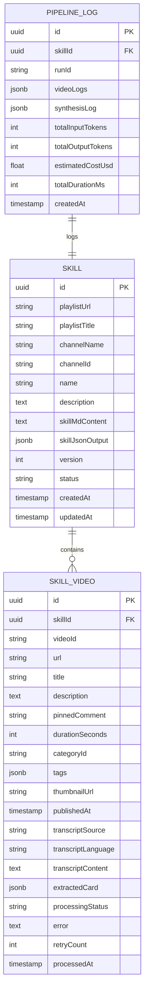

# 4. Technical Specification

## Stack Definitiva

| Camada | Tecnologia | Versão (Target) |
|:---|:---|:---|
| Frontend Framework | Next.js | 15.x |
| Frontend Language | TypeScript | 5.x |
| Frontend Styling | CSS Modules + design tokens | — |
| Backend Framework | Hono | 4.x |
| Backend Language | TypeScript (ESM) | 5.x |
| Job Queue | BullMQ | 5.x |
| Cache / Queue Backend | Redis | 7.x |
| Database | PostgreSQL + pgvector | 16.x |
| ORM | Drizzle ORM | 0.3x |
| LLM | Gemini 3.6 Flash (Google AI SDK) | latest |
| Validation | Zod | 3.x |
| Transcript Extraction | youtube-transcript (npm) | latest |
| YouTube API | YouTube Data API v3 | v3 |
| Package Manager | pnpm | 9.x |

## Data Model (ERD)

## API Contract

### Endpoints

| Method | Path | Descrição | Request Body | Response |
|:---|:---|:---|:---|:---|
| `POST` | `/api/skills` | Criar nova skill a partir de playlist | `{ playlistUrl: string }` | `{ id, status: "queued" }` |
| `GET` | `/api/skills` | Listar todas as skills | — | `Skill[]` |
| `GET` | `/api/skills/:id` | Detalhe de uma skill | — | `Skill + videos[]` |
| `GET` | `/api/skills/:id/download` | Download do SKILL.md | — | `text/markdown` |
| `POST` | `/api/skills/:id/refresh` | Atualizar skill (vídeos novos) | — | `{ status: "queued" }` |
| `DELETE` | `/api/skills/:id` | Remover skill | — | `204` |
| `GET` | `/api/queue/status` | Status geral da fila | — | `QueueStatus` |
| `GET` | `/api/queue/jobs/:jobId` | Status de um job específico | — | `JobDetail` |
| `GET` | `/api/logs/:skillId` | Logs de pipeline por skill | — | `PipelineLog[]` |
